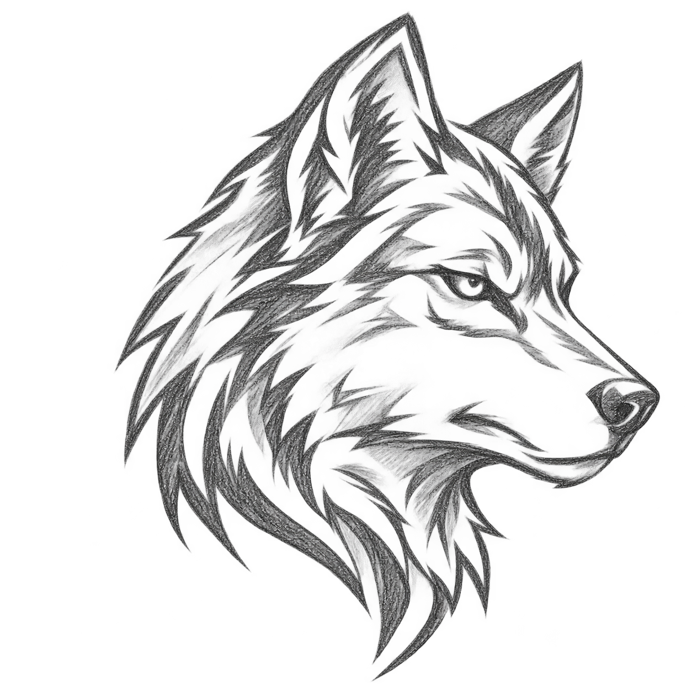
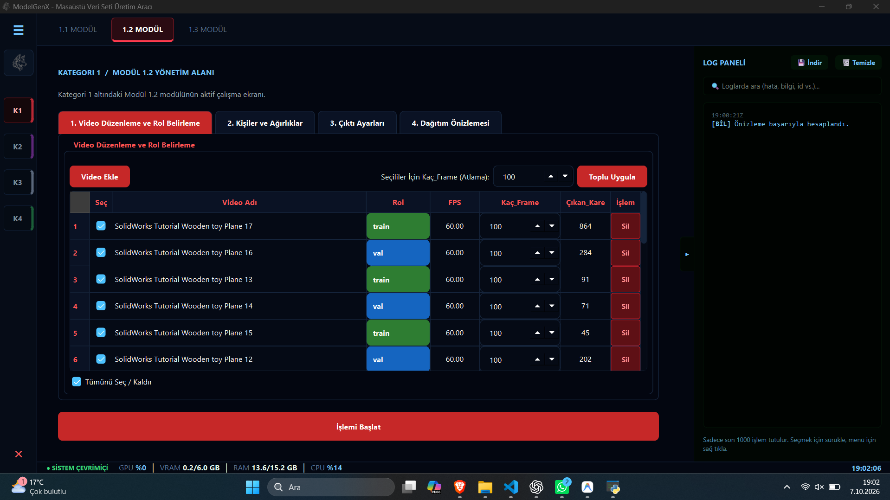
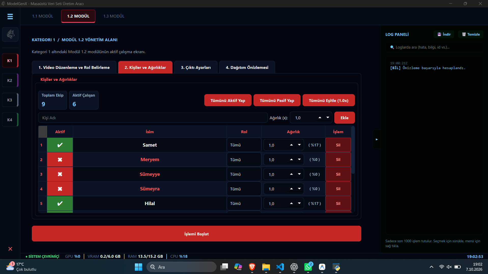
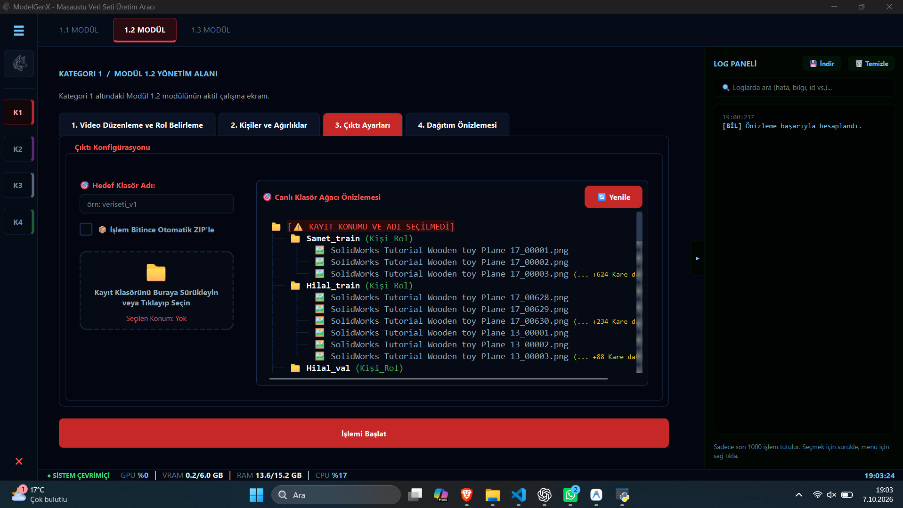
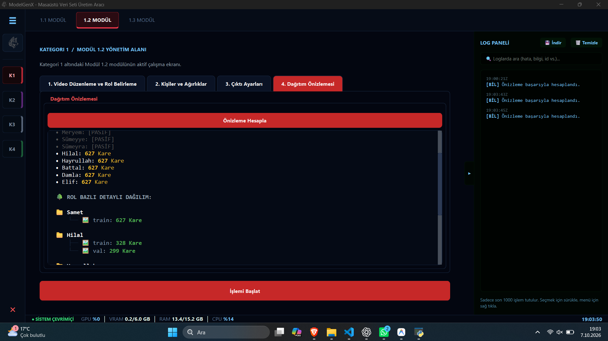

<div align="center">
  
  <h1>ModelGenX</h1>
  <p><b>Masaüstü Yapay Zeka Veri Seti Üretim Aracı</b></p>
</div>

--- 

## 📖 Proje Hakkında
**ModelGenX**, yapay zeka modelleri eğitmek için gereken veri setlerini hızlı, esnek ve modüler bir şekilde oluşturmanızı sağlayan modern bir masaüstü uygulamasıdır. 
Kullanıcı dostu arayüzü sayesinde videoları kolayca indirebilir, bu videolardan çerçeveler (frame) ayıklayabilir ve verileri sınıflandırarak projeniz için hazır hale getirebilirsiniz.

## ✨ Özellikler
- **🎥 Gelişmiş İndirme Modülü:** YouTube vb. platformlardan tekil video veya oynatma listelerini (playlist) paralel olarak çoklu işlemci gücüyle (multi-thread) indirme.
- **🛡️ 403 Bypass & Kurtarma:** Video indirilirken oluşan erişim engellerini otomatik olarak atlatma ve farklı API istemcileri (Android/Web) ile indirmeyi tekrar deneme özelliği.
- **🖼️ Frame (Çerçeve) İşlemleri:** İndirilen videolardan yapay zeka eğitimi için otomatik kare (frame) ayıklama ve paylaştırma.
- **📊 Canlı Log ve Gelişmiş Arayüz:** Modern PyQt6 arayüzü, Toast bildirimleri, şık log paneli ve interaktif geçiş animasyonları.
- **📁 Düzenli Çıktı Yönetimi:** Veri setlerini belirlediğiniz klasörlere otomatik kategorize etme.

## 🛠️ Kullanılan Teknolojiler
- **Python 3.10+**
- **PyQt6** (Modern, donanım hızlandırmalı masaüstü arayüzü)
- **yt-dlp** (Güçlü ve güncel video indirme motoru)
- **FFmpeg** (Video/Ses/Frame işleme)

## 📸 Ekran Görüntüleri

ModelGenX içerisindeki Frame Paylaştırma adımlarını gösteren ekran görüntüleri:

| Adım 1 | Adım 2 |
| :---: | :---: |
|  |  |

| Adım 3 | Adım 4 |
| :---: | :---: |
|  |  |

## 🚀 Kurulum

1. Depoyu bilgisayarınıza klonlayın:
```bash
git clone https://github.com/Samet4216/ModelGenX.git
cd ModelGenX
```

2. Gerekli kütüphaneleri yükleyin:
```bash
pip install -r requirements.txt
```

3. **FFmpeg** aracının bilgisayarınızda yüklü olduğundan ve sistem ortam değişkenlerine (`PATH`) eklendiğinden emin olun.

4. Uygulamayı başlatın:
```bash
python main.py
```

## 🎯 Kullanım
- Sol menüden çalışmak istediğiniz kategoriyi ve üst sekmelerden aktif modülü seçin.
- **İndirme Modülü** kısmından video linklerini ekleyerek eğitim videolarını toplayın.
- İndirilen videoları Frame İşlemleri bölümünden modeliniz için eğitim karelerine dönüştürün.
- Log panelinden anlık hataları ve indirme istatistiklerini takip edin.

---
*Geliştirici: [Samet4216](https://github.com/Samet4216)*
